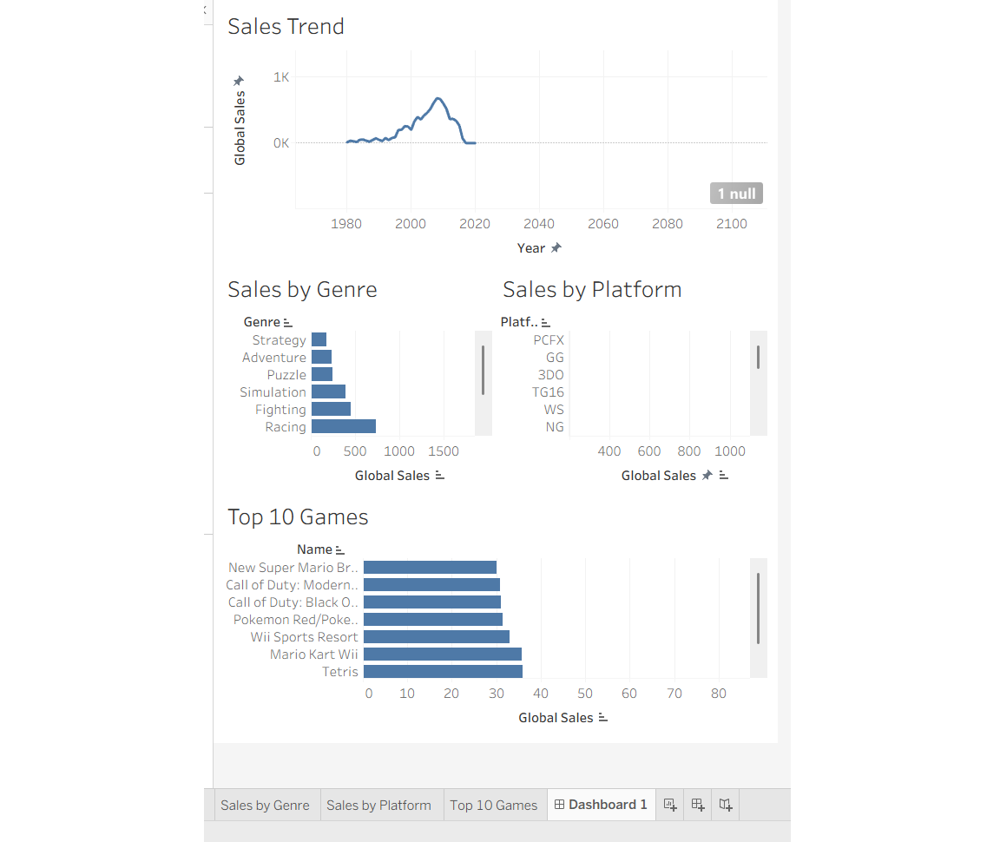

# 🎮 Video Game Sales Analysis Dashboard (Tableau)

## 📌 Project Overview
This project presents an interactive Tableau dashboard built to analyze global video game sales data.  
The aim is to explore sales trends over time, identify the most popular genres and platforms, and highlight top-performing games worldwide.

The dashboard provides a clear view of how the gaming industry has evolved and what factors contribute to higher game sales.

---

## 🛠 Tools & Technologies Used
- **Tableau Public** – Dashboard design and data visualization  
- **CSV Dataset** – Video game sales data  
- **GitHub** – Project hosting and version control  

---

## 📂 Dataset Information
The dataset contains detailed records of video game sales across multiple regions and platforms.

### Key Attributes:
- Game Name  
- Platform  
- Genre  
- Publisher  
- Year of Release  
- North America Sales  
- Europe Sales  
- Japan Sales  
- Other Region Sales  
- Global Sales  

---

## 📊 Dashboard Features

### 1️⃣ Sales Trend
Shows how global video game sales have changed over the years, helping identify growth and decline periods.

### 2️⃣ Sales by Genre
Highlights which genres (Action, Sports, Shooter, etc.) generate the most revenue.

### 3️⃣ Sales by Platform
Displays performance of different gaming platforms such as PlayStation, Xbox, and Wii.

### 4️⃣ Top 10 Games
Lists the highest-selling video games globally for quick comparison.

---

## 📷 Dashboard Preview

---

## 🚀 Project Structure
Video-Game-Sales-Tableau-Dashboard
│
├── vgsales.csv # Dataset
├── Video_Game_Sales_Dashboard.twbx # Tableau dashboard file
├── dashboard.png # Dashboard screenshot
└── README.md # Documentation

---

## 📈 Key Insights
- Action and Sports genres contribute the most to global sales  
- Platforms like Wii and PlayStation dominate the market  
- Games such as Wii Sports and Super Mario Bros. are among the top-selling titles  
- Sales peaked during certain years, indicating strong industry growth phases  

---

## 🎯 Project Purpose
This project demonstrates:

- Data analysis using real-world datasets  
- Dashboard creation using Tableau  
- Ability to extract meaningful insights from data  
- Clear and effective data storytelling  

---

## 👩‍💻 Author
**Prerna Kumari**

---

⭐ If you found this project useful, feel free to star the repository!
